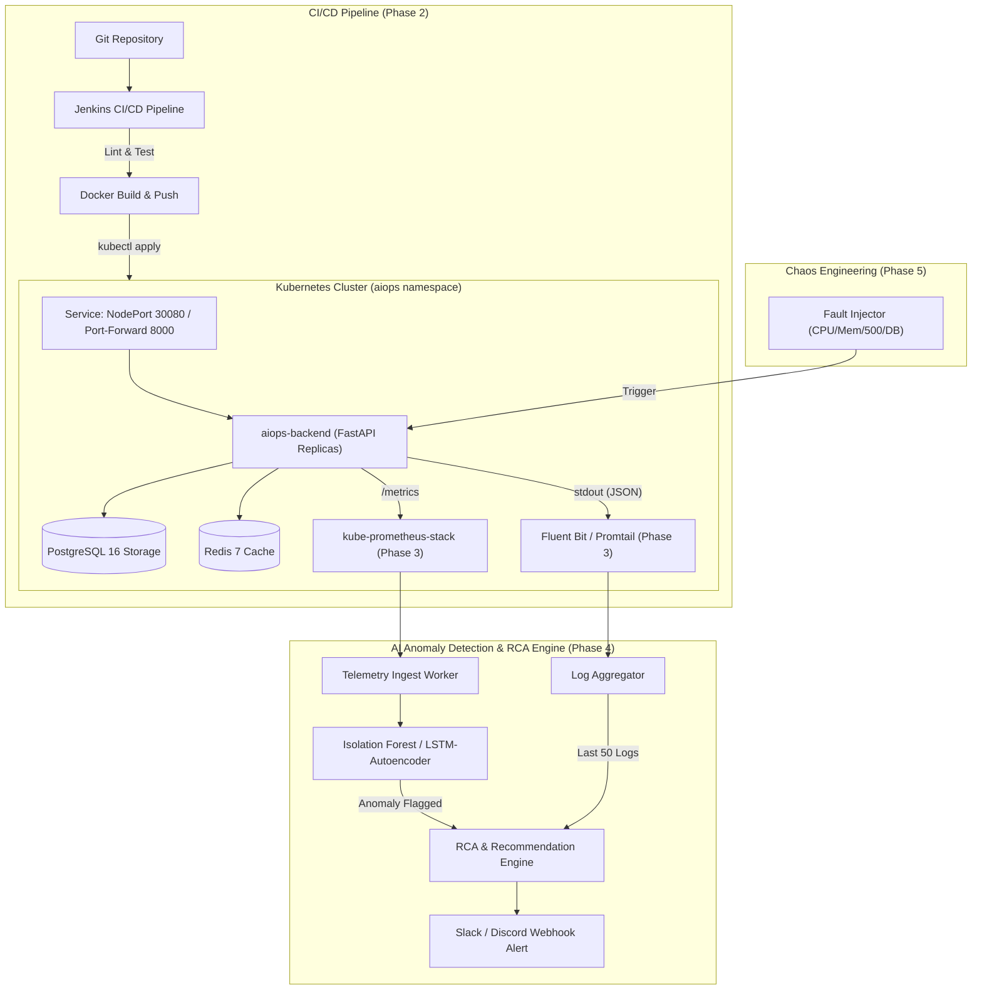

# End-to-End AIOps Platform: Automated RCA & Anomaly Detection

A production-grade, closed-loop AIOps platform that runs on Kubernetes, streams metrics and logs, applies machine learning models for anomaly detection, diagnoses root causes (RCA), and dispatches automated alerts and remediations.

---

## High-Level Architecture



---

## Phase 1: Local Infrastructure & Microservices Setup

### Overview
Phase 1 establishes the containerized microservices stack, baseline resource limits, health probes, and Kubernetes manifests:

- **Backend Application (`backend/`)**:
  - FastAPI asynchronous microservice with PostgreSQL persistence and Redis cache-aside.
  - Native Prometheus instrumentation exposing `/metrics` via `prometheus-fastapi-instrumentator`.
  - Structured JSON logging formatted for direct consumption by Promtail / Fluent Bit.
  - Probes: `/api/v1/health/live` (process liveness) and `/api/v1/health/ready` (checks DB and Redis).
  - Built-in Chaos Simulation endpoints:
    - `POST /api/v1/chaos/cpu`: Multi-threaded CPU burn to simulate compute exhaustion.
    - `POST /api/v1/chaos/memory`: Memory heap allocation to simulate leaks and OOM scenarios.
    - `POST /api/v1/chaos/error-rate`: Controlled HTTP 500 error injection.
    - `POST /api/v1/chaos/latency`: Artificial latency injection.
- **Microservices Data Tier**:
  - PostgreSQL 16 Alpine with PersistentVolumeClaim (`postgres-pvc`) and `pg_isready` health probes.
  - Redis 7 Alpine with health checking via `redis-cli ping`.
- **Production Kubernetes Manifests (`k8s/`)**:
  - Explicit CPU and Memory limits (Requests: 100m CPU / 128Mi RAM; Limits: 500m CPU / 512Mi RAM) to provide a predictable baseline for anomaly detection.
  - ConfigMaps and Secrets for decoupled 12-factor configuration.
  - Prometheus auto-scraping pod annotations.
  - Service exposing port 8000 (NodePort 30080).

---

## Project Structure

```
Final Project/
├── backend/
│   ├── app/
│   │   ├── api/
│   │   │   ├── chaos.py               # Chaos & fault-injection endpoints
│   │   │   ├── health.py              # Liveness and Readiness probes
│   │   │   └── orders.py              # Business CRUD API (DB + Cache)
│   │   ├── config.py                  # Pydantic Settings
│   │   ├── database.py                # SQLAlchemy DB engine & healthcheck
│   │   ├── logger.py                  # Structured JSON logger
│   │   ├── main.py                    # FastAPI app entrypoint & metrics instrumentor
│   │   ├── models.py                  # ORM database models
│   │   ├── redis_client.py            # Redis client & healthcheck
│   │   └── schemas.py                 # Pydantic request/response schemas
│   ├── tests/
│   │   ├── test_health.py             # Health & metrics probe unit tests
│   │   └── test_orders.py             # Business logic unit tests
│   ├── Dockerfile                     # Multi-stage secure Dockerfile (non-root)
│   ├── .dockerignore
│   └── requirements.txt
├── k8s/
│   ├── 00-namespace.yaml              # Dedicated 'aiops' namespace
│   ├── 01-configmaps.yaml             # App configuration
│   ├── 02-secrets.yaml                # DB and cache credentials
│   ├── 03-postgres-pvc.yaml           # PVC for PostgreSQL
│   ├── 03-postgres.yaml               # PostgreSQL Deployment & Service
│   ├── 04-redis.yaml                  # Redis Deployment & Service
│   ├── 05-backend.yaml                # FastAPI Deployment (2 replicas, limits, probes)
│   └── 06-backend-service.yaml        # NodePort Service (Port 30080)
├── scripts/
│   ├── setup_cluster.ps1              # Cluster detection & bootstrap helper
│   ├── build_and_deploy.ps1           # Build, image load, and manifest deployment
│   └── test_endpoints.ps1             # End-to-end API sanity verification
├── docker-compose.yml                 # Standalone local execution without K8s
└── README.md
```

---

## Quick Start Guide

### Option 1: Standalone Run with Docker Compose
To run the full stack immediately on your local Docker engine:
```powershell
docker compose up -d --build
```
Verify the services:
```powershell
docker compose ps
curl http://localhost:8000/api/v1/health/ready
curl http://localhost:8000/metrics
```

---

### Option 2: Deploy to Kubernetes Cluster

#### Step 1: Initialize Local Cluster
Ensure Docker Desktop is running. Then choose one of:
- **Docker Desktop Kubernetes (Recommended on Windows)**:
  - Docker Desktop Settings -> Kubernetes -> check **Enable Kubernetes** -> Apply & Restart.
- **Minikube**:
  ```powershell
  minikube start --driver=docker
  ```
- **Kind**:
  ```powershell
  kind create cluster --name aiops-cluster
  ```

Run the cluster helper to verify:
```powershell
.\scripts\setup_cluster.ps1
```

#### Step 2: Build & Deploy
Execute the one-click build and deployment script:
```powershell
.\scripts\build_and_deploy.ps1
```

#### Step 3: Access the Application
- **Direct Access**: `http://localhost:30080` (if using Docker Desktop)
- **Port-Forwarding**:
  ```powershell
  kubectl port-forward svc/backend-service 8000:8000 -n aiops
  ```
- **Swagger Documentation**: `http://localhost:8000/docs`
- **Prometheus Metrics**: `http://localhost:8000/metrics`

#### Step 4: Run Automated End-to-End Sanity Tests
```powershell
.\scripts\test_endpoints.ps1 -BaseUrl "http://localhost:8000"
```

---

## Phase 3: Telemetry & Data Pipeline (Prometheus & Logging)

### Overview
Phase 3 establishes full cluster observability, programmatic telemetry query clients, and a background ingestion worker:

- **Monitoring Stack (`monitoring/`)**:
  - `kube-prometheus-stack` deploying Prometheus Operator, Prometheus Server, and Grafana.
  - Tailored `prometheus-values.yaml` (6h retention, lightweight CPU/RAM requests).
  - ServiceMonitor (`backend-servicemonitor.yaml`) scraping `:8000/metrics` every 10 seconds.
  - Pre-built Grafana Dashboard (`grafana-dashboard-aiops.json`) visualizing CPU, memory, RPS, error rate %, and chaos events.
- **Log Aggregation Stack**:
  - `loki-stack` deploying Grafana Loki and Promtail DaemonSet to ship container stdout JSON logs.
- **Programmatic Python API Clients (`telemetry/`)**:
  - `PrometheusClient`: Queries instant (`/api/v1/query`) and range (`/api/v1/query_range`) PromQL metrics (CPU, RAM, error rate %, P95 latency).
  - `LogStoreClient`: Queries Loki API via LogQL with automatic fallback to `kubectl logs` for maximum reliability.
- **Background Telemetry Ingestion Worker (`telemetry/ingestion_worker.py`)**:
  - Continuously polls metric vectors and error logs every 10 seconds.
  - Generates sliding window feature matrices (`TelemetryBuffer`) feeding Phase 4's AI model.
  - Renders live telemetry tables in console and exports snapshots to `data/telemetry_latest.json`.

### How to Run Monitoring & Telemetry

#### Step 1: Install Prometheus, Grafana, and Loki via Helm
```powershell
.\scripts\install_monitoring.ps1
```

#### Step 2: Port-Forward Monitoring Services
```powershell
.\scripts\port_forward_monitoring.ps1
```
- **Prometheus**: [http://localhost:9090](http://localhost:9090)
- **Grafana**: [http://localhost:3000](http://localhost:3000) (Login: `admin` / `admin`)
- **Loki**: [http://localhost:3100](http://localhost:3100)

#### Step 3: Run the Telemetry Ingestion Worker
```powershell
# Run a single evaluation test cycle:
python telemetry/ingestion_worker.py --once

# Or run the continuous background poller:
python telemetry/ingestion_worker.py --interval 10
```

---

## Future Roadmap

| Phase | Status | Key Deliverables |
|---|---|---|
| **Phase 1** | Completed | FastAPI, Postgres, Redis, K8s manifests, resource limits, health & chaos APIs |
| **Phase 2** | Completed | Jenkinsfile CI/CD pipeline, Docker build/push, K8s dev deploy, HPA & PDB |
| **Phase 3** | Completed | kube-prometheus-stack, Loki, Promtail, Python API clients, Telemetry Ingestion Worker |
| **Phase 4** | Next | Unsupervised ML anomaly detection (Isolation Forest), log correlation RCA engine, alerts |
| **Phase 5** | Planned | End-to-end chaos engineering tests, closed-loop verification, documentation & polish |

